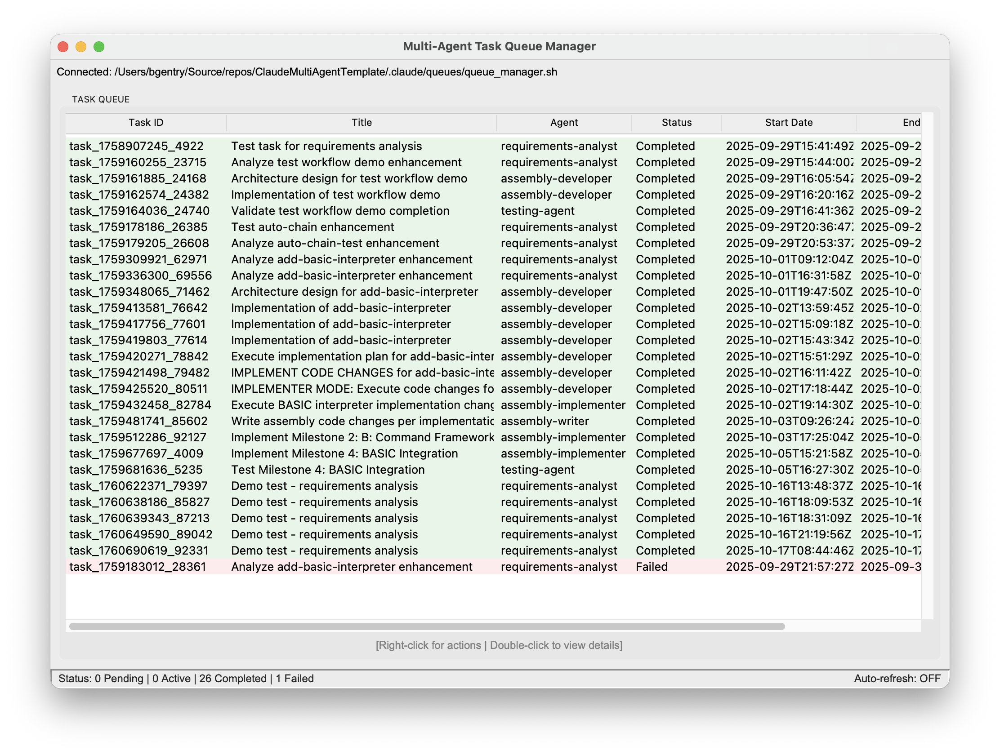
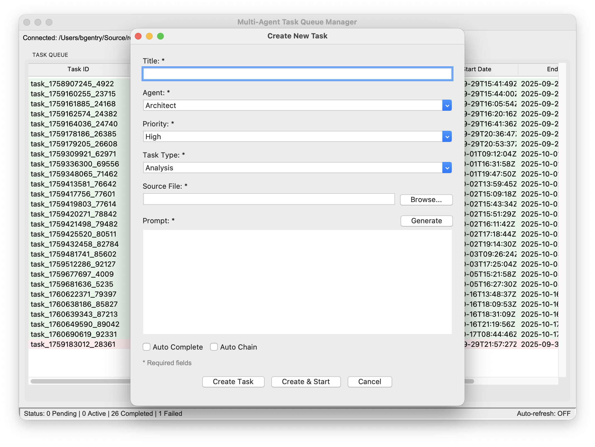
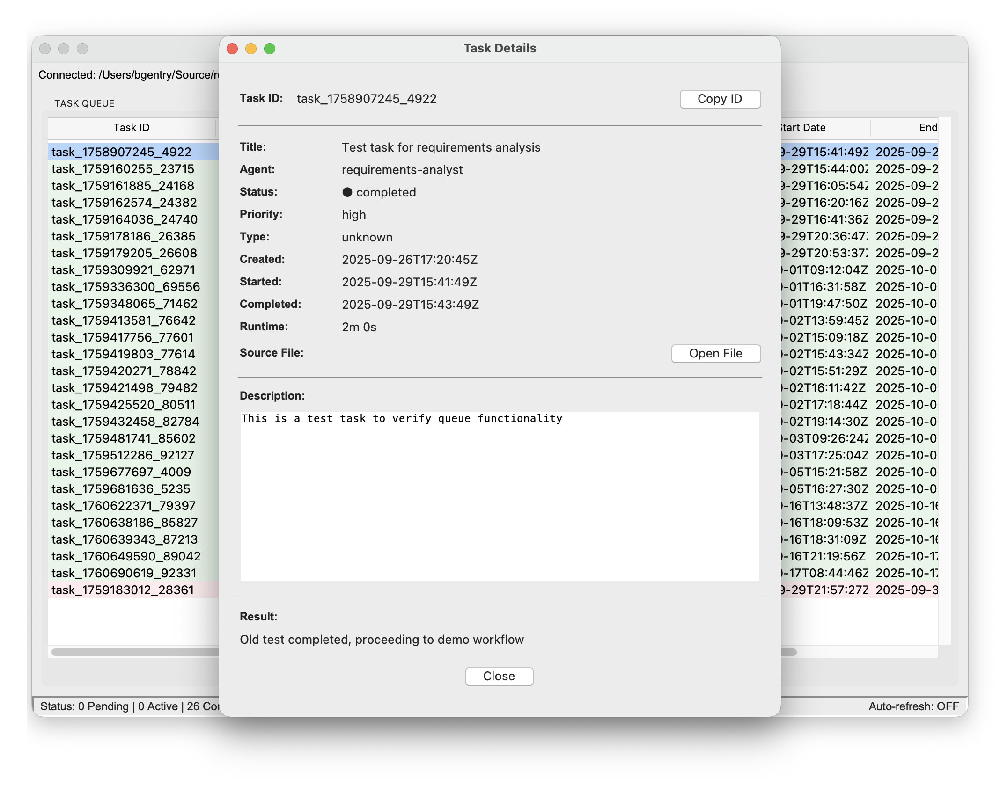

# Multi-Agent Task Queue Manager

A graphical user interface for managing multi-agent development workflows using the Claude Multi-Agent Development Template.


## Features

- 📋 **Task Management** - Create, start, cancel, and monitor tasks
- 🤖 **AI-Powered Descriptions** - Generate task descriptions using Claude API
- ⚡ **Quick Actions** - Create & Start button for immediate task execution
- 🔧 **Auto Complete & Chain** - Automated task completion and chaining options
- 🔄 **Auto-Refresh** - Real-time updates of task status
- 🎯 **Multi-Project Support** - Connect to different queue managers
- 📊 **Operations Log Viewer** - Track all queue operations
- 🎨 **Clean UI** - Simple, intuitive Tkinter interface
- 🚀 **Zero Dependencies** - Uses only Python standard library

## Screenshots

### Main Window
The main window shows all tasks across all statuses (pending, active, completed, failed) in a single table view.



### Create Task
Create new tasks with AI-powered description generation, agent selection, and automated workflow options.



### Task Details
Double-click any task to view complete details including description, timestamps, and access to logs.



## Requirements

- Python 3.7 or higher
- Tkinter (included with Python)
- A project using the Claude Multi-Agent Development Template

## Installation

### Quick Start

```bash
# Clone the repository
git clone https://github.com/yourusername/ClaudeMultiAgentUI.git
cd ClaudeMultiAgentUI

# Run directly 
python -m src.claude_queue_ui.main
```

## Usage

### 1. Launch the Application

```bash
python -m src.claude_queue_ui.main
```

### 2. Connect to a Queue Manager

1. Click **File > Connect...**
2. Browse to your project's `queue_manager.sh` file
   - Typically located at: `<project>/.claude/queues/queue_manager.sh`
3. The UI will validate the project structure
4. Click **Connect**

### 3. Managing Tasks

#### Create a Task
- Right-click in empty space → **Create Task...**
- Or: Press `Ctrl+N`
- Fill in all required fields:
  - **Title**: Short description of the task
  - **Agent**: Select from available agents
  - **Priority**: Critical, High, Normal, or Low
  - **Task Type**: Analysis, Technical Analysis, Implementation, or Testing
  - **Source File**: Browse to select (usually a markdown enhancement file)
  - **Description**: Task details (use **Generate** button for AI-assisted creation)
- **Optional**: Check **Auto Complete** or **Auto Chain** for automated workflows
- Choose an action:
  - **Create Task**: Add task to queue as pending
  - **Create & Start**: Add task and immediately start execution
  - **Cancel**: Discard task

##### AI-Powered Task Descriptions
- Click the **Generate** button to create detailed task descriptions automatically
- Requires Claude API key (configure in Settings > Configure Claude API Key...)
- Falls back to template-based generation if API key not configured
- Generated descriptions include goals, deliverables, requirements, and acceptance criteria

#### Start a Task
- Right-click on a pending task → **Start Task**
- Or: Select a task and press `Enter`
- The agent will execute (this may take some time)
- Task status will update when complete

#### Cancel a Task
- Right-click on a pending/active task → **Cancel Task**
- Or: Select a task and press `Delete`
- Confirm the cancellation

#### View Task Details
- Double-click any task
- Or: Right-click → **View Details...**
- Shows complete task information
- Access task logs if available

#### Cancel All Tasks
- Right-click in empty space → **Cancel All Tasks**
- Confirms before cancelling all pending and active tasks

### 4. View Logs

#### Operations Log
- Click **Logs > View Operations Log**
- Or: Press `Ctrl+L`
- Shows all queue management operations
- Useful for debugging and auditing

#### Task-Specific Logs
- Right-click task → **View Task Log...**
- Or: View Details → **View Log** button
- Shows detailed agent execution log for the task

## Keyboard Shortcuts

| Shortcut | Action |
|----------|--------|
| `Ctrl+O` | Connect to queue manager |
| `Ctrl+N` | Create new task |
| `Ctrl+L` | View operations log |
| `Ctrl+R` / `F5` | Refresh task list |
| `Ctrl+Q` | Quit application |
| `Delete` | Cancel selected task |
| `Enter` | Start selected task (if pending) |
| `Ctrl+C` | Copy selected task ID |

## Context Menus

### Right-Click on Empty Space
- Create Task...
- Cancel All Tasks
- Refresh

### Right-Click on Task
- Start Task (if pending)
- Cancel Task (if pending/active)
- View Details...
- View Task Log... (if log exists)
- Copy Task ID
- Refresh

## Project Structure

```
ClaudeMultiAgentUI/
├── src/
│   └── claude_queue_ui/
│       ├── __init__.py
│       ├── main.py           # Main application
│       ├── config.py          # Configuration
│       ├── queue_interface.py # Queue manager interface
│       ├── queue_models.py    # Data models
│       └── dialogs.py         # Dialog windows
├── tests/                     # Unit tests
├── assets/                    # Images, icons
├── README.md
├── requirements.txt
├── setup.py
└── LICENSE
```

## Configuration

The application uses sensible defaults but can be customized by editing `src/claude_queue_ui/config.py`:

- **Auto-refresh interval** - Default: 3 seconds
- **Max log lines** - Default: 1000 lines
- **Window size** - Default: 1000x700
- **Colors** - Status and priority colors

## Multi-Project Workflow

The UI supports managing multiple projects:

1. **Connect** to Project A's queue manager
2. Work with Project A tasks
3. **File > Connect...** to switch to Project B
4. Work with Project B tasks
5. Switch back anytime

Recent connections could be added in future versions.

## Troubleshooting

### "Queue manager script not found"
- Ensure you're selecting the correct `queue_manager.sh` file
- Path should be: `<project>/.claude/queues/queue_manager.sh`

### "Queue file not found"
- Ensure your project has the queue system initialized
- Check that `.claude/queues/task_queue.json` exists

### Tasks not showing
- Click **Refresh** or press `F5`
- Check if auto-refresh is enabled in status bar
- Verify connection status in header bar

### Agent not starting
- Starting a task launches the agent in the background
- The task will show as "Active" status immediately
- Agent execution may take several minutes
- Task status updates automatically when complete
- Check the operations log for errors

### Cross-Platform Issues

**macOS**: Right-click may require `Ctrl+Click` or two-finger tap

**Windows**: Ensure Git Bash or WSL is installed for bash script execution

**Linux**: Should work out of the box


## Contributing

Contributions are welcome! Please:

1. Fork the repository
2. Create a feature branch
3. Make your changes
4. Add tests if applicable
5. Submit a pull request

## License

MIT License - see LICENSE file for details

## Related Projects

- [Claude Multi-Agent Template](https://github.com/yourusername/ClaudeMultiAgentTemplate) - The multi-agent system this UI manages

## Changelog

### Version 1.0.0 (2025-01-XX)
- Initial release
- Task management (create, start, cancel)
- Multi-project support via connection dialog
- Operations log viewer
- Task details viewer
- Auto-refresh functionality
- Context menus and keyboard shortcuts

---

**Built with ❤️ for the Claude Multi-Agent Development Template**