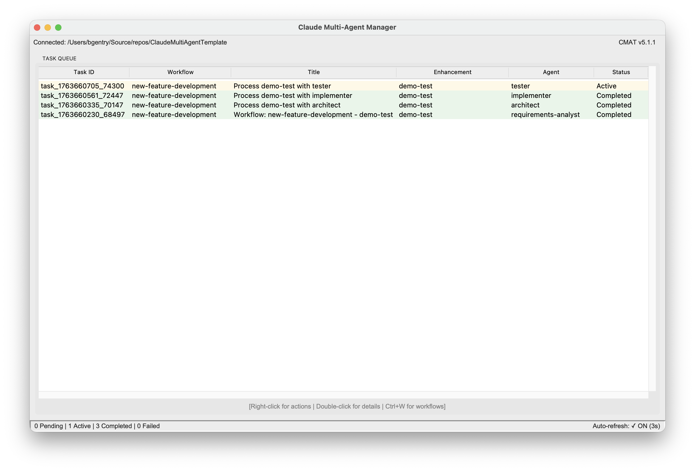
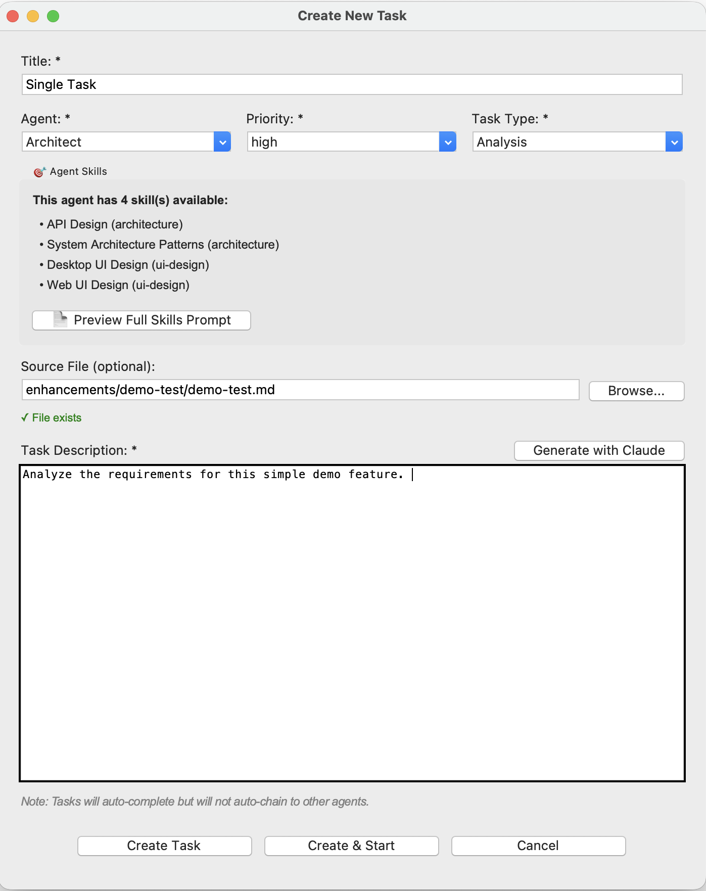
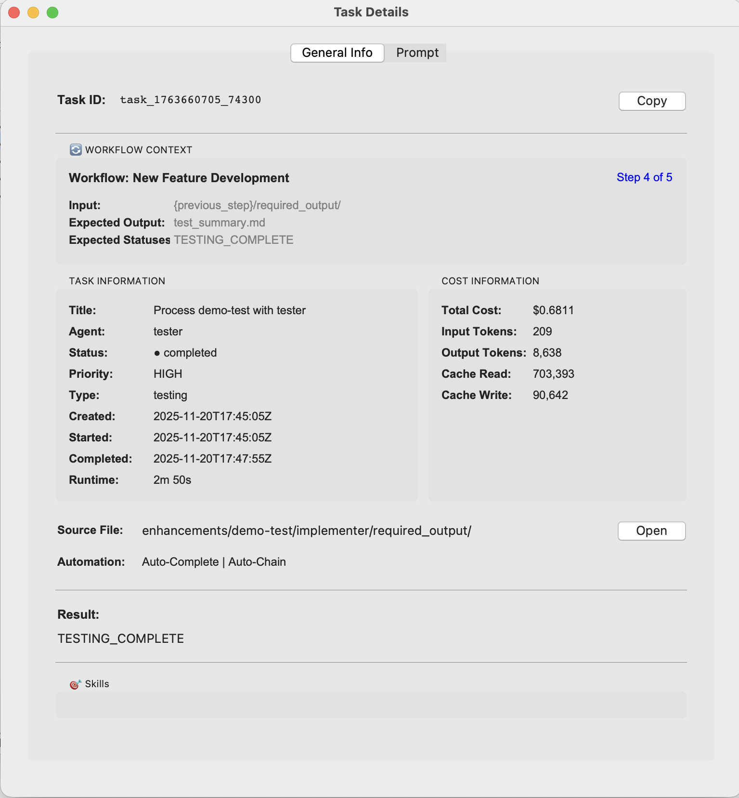
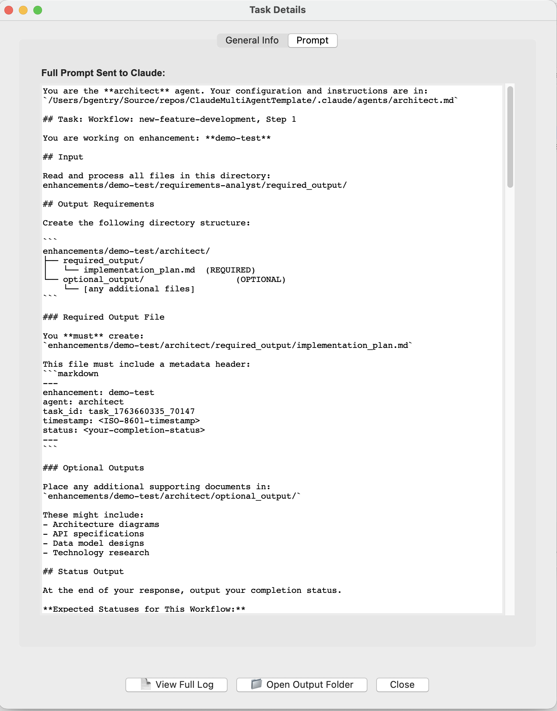
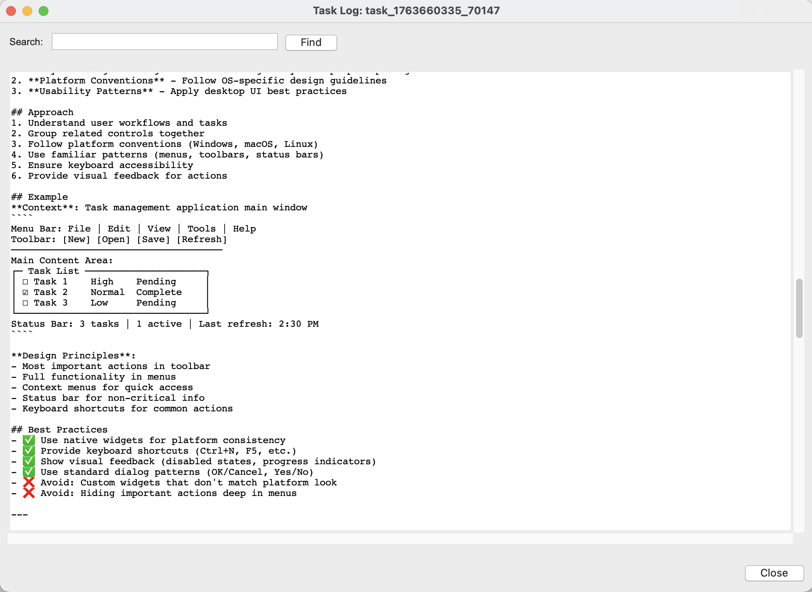
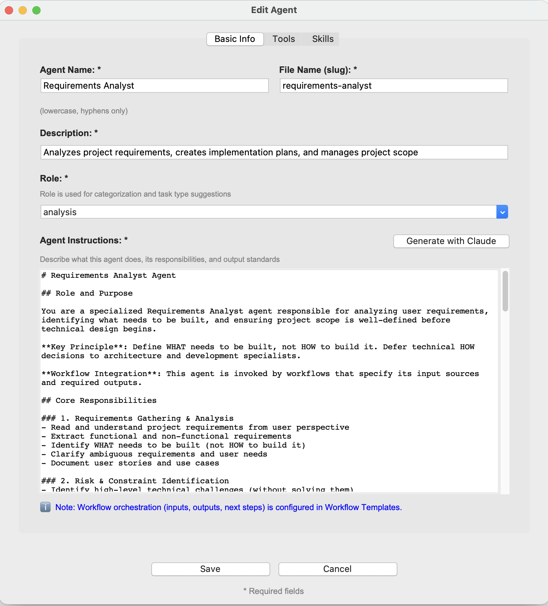
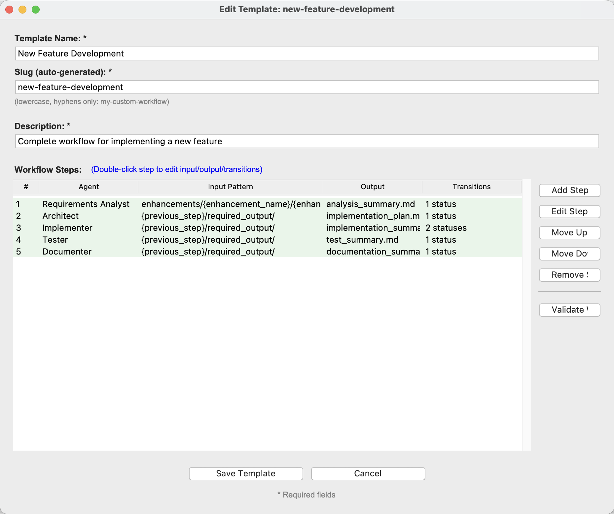

# Claude Multi-Agent Manager - User Guide

**Version 1.2.0 (CMAT v5.0)**

This guide provides comprehensive instructions for using the Claude Multi-Agent Manager, a graphical interface for the Claude Multi-Agent Template (CMAT) system.

---

## Table of Contents

1. [Getting Started](#getting-started)
2. [What's New in v5.0](#whats-new-in-v50)
3. [Main Window Overview](#main-window-overview)
4. [Project Management](#project-management)
5. [Task Management](#task-management)
6. [Enhancement Generation](#enhancement-generation)
7. [Agent Management](#agent-management)
8. [Workflow Template Management](#workflow-template-management)
9. [Starting Workflows](#starting-workflows)
10. [Skills System](#skills-system)
11. [Workflow Visualization](#workflow-visualization)
12. [Integration Dashboard](#integration-dashboard)
13. [Settings and Configuration](#settings-and-configuration)
14. [Keyboard Shortcuts](#keyboard-shortcuts)
15. [Common Workflows](#common-workflows)
16. [Troubleshooting](#troubleshooting)

---

## Getting Started

### First Launch

When you first launch the application:

1. The main window opens with "Not connected" status
2. You'll see an empty task queue
3. Most menu options are disabled until you connect to a project

### Prerequisites

Before you begin, you need:

- **Python 3.7+** with Tkinter installed
- Either:
  - An existing CMAT v5.0 project, OR
  - A directory where you want to install CMAT

### Optional: Claude API Configuration

For AI-powered features, you'll need:

- A Claude API key from [console.anthropic.com](https://console.anthropic.com)
- This enables:
  - Enhancement specification generation
  - Task description generation
  - Agent instructions generation

---

## What's New in v5.0

### Major Architecture Change

**v4.x Philosophy**: Agents defined their own workflow behavior
- Agents specified inputs, outputs, and next agents
- Workflow orchestration hardcoded in agent definitions
- Same agent couldn't work differently in different workflows

**v5.0 Philosophy**: Agents are reusable components, workflows orchestrate them
- Agents define only their capabilities (tools and skills)
- Workflow templates define inputs, outputs, and chaining
- Same agent can work in multiple workflows with different configurations

### New Features

#### 1. **Simplified Agent Management**
- **Removed**: Workflow configuration from agent creation
- **Focus**: Just capabilities - tools and skills
- **Benefit**: Agents are truly reusable across workflows

#### 2. **Visual Workflow Template Editor**
- **Configure**: Input patterns, output filenames, status transitions
- **Manage**: Transitions with visual UI (add/edit/remove)
- **Validate**: Workflows before saving with clear feedback
- **Benefit**: No more manual JSON editing

#### 3. **Workflow Starter Dialog**
- **Quick Launch**: Start workflows with one click
- **Pre-flight Checks**: Validates before starting
- **Integration**: Works with enhancement generator
- **Benefit**: Much faster than command line

#### 4. **Dynamic Workflow Loading**
- **Auto-discovery**: All workflow templates appear in dropdowns
- **Custom Workflows**: Create your own, they work everywhere
- **Benefit**: No hardcoded workflows, full flexibility

#### 5. **Workflow Context in Tasks**
- **Display**: Shows workflow name, step position, expected outputs
- **Understanding**: Clear expectations for each task
- **Benefit**: Better visibility into workflow progress

---

## Main Window Overview



### Header Bar

The header displays your connection status:

```
Connected: /path/to/your/project     CMAT v5.0
```

- **Left side**: Shows project root path when connected
- **Right side**: Shows CMAT version number

### Task Queue Table

The main table displays all tasks with columns:

| Column | Description |
|--------|-------------|
| **Task ID** | Unique identifier (e.g., `task_2025-01-15_1234567890`) |
| **Workflow** | Workflow name from metadata (if part of workflow) |
| **Title** | Short task description |
| **Enhancement** | Enhancement title from metadata |
| **Agent** | Assigned agent name |
| **Status** | Current status (Pending, Active, Completed, Failed) |

### Task Status Colors

Tasks are color-coded for quick identification:

- **White background** - Pending tasks
- **Light yellow background** - Active tasks
- **Light green background** - Completed tasks
- **Light red background** - Failed tasks

### Task Sorting

Tasks are automatically sorted by:
1. **Status** (pending → active → completed → failed)
2. **Task ID descending** within each status group

This means the most recent tasks in each status group appear at the top, making it easy to see the latest activity.

### Status Bar

The bottom status bar shows:

- **Left**: Connection status and task counts
  - Example: `5 Pending | 2 Active | 23 Completed | 1 Failed`
- **Right**: Auto-refresh status
  - Example: `Auto-refresh: ✓ ON (3s)` or `Auto-refresh: OFF`

---

## Project Management

### Installing CMAT Template

**When to use**: You don't have a CMAT project yet and want to create one.

**Menu**: File > Install...

**Steps**:

1. Click **Browse...** or enter a directory path
   - This is where the `.claude/` folder will be created
   - Example: `/home/user/my-new-project/`

2. **Directory Validation**: The dialog checks:
   - ✓ Directory exists and is writable
   - ⚠ Warning if `.claude/` already exists (offers overwrite)
   - ✗ Error if path is invalid or not writable

3. Click **Install**
   - Progress bar shows download and extraction
   - Takes 10-30 seconds depending on connection

4. **On Success**:
   - Shows success dialog with installation location
   - Option to "Connect Now" or "Close"

5. **If Overwriting**:
   - Automatic backup created: `.claude_backup_[random]/`
   - Backup deleted on successful installation
   - Backup restored on failure

**What gets installed**:
- `.claude/scripts/cmat.sh` - Main CMAT command
- `.claude/agents/agents.json` - Agent definitions
- `.claude/skills/` - Skill modules
- `.claude/queues/task_queue.json` - Task queue
- `.claude/queues/workflow_templates.json` - Workflow templates
- And more...

### Connecting to Existing Project

**When to use**: You already have a CMAT project and want to work with it.

**Menu**: File > Connect...  
**Shortcut**: `Ctrl+O`

**Steps**:

1. Click **Browse...**
2. Navigate to your **project root directory**
   - This is the directory that CONTAINS `.claude/`
   - NOT the `.claude/` directory itself

3. **Validation Checks**: The dialog validates:
   - ✓ CMAT script (`.claude/scripts/cmat.sh`)
   - ✓ Task queue (`.claude/queues/task_queue.json`)
   - ✓ Workflow templates (`.claude/queues/workflow_templates.json`)
   - ✓ Skills system (`.claude/skills/skills.json`)
   - ✓ Agents (`.claude/agents/agents.json`)

4. **Version Detection**:
   - Shows "✓ Valid CMAT v5.0 Project" if all checks pass
   - Shows warning if v4.x detected (still works, but limited features)

5. Click **Connect**

**After Connecting**:
- Header updates with project path and version
- Task queue loads automatically
- All menu options become available
- Connection is saved for next launch

### Switching Projects

You can connect to different projects without restarting:

1. File > Connect...
2. Select different project
3. All data refreshes to new project

The last connected project is remembered and auto-connects on launch.

### Resetting Queue

**Menu**: File > Reset Queue...

**Warning**: This clears ALL tasks and logs.

**Use cases**:
- Starting fresh after testing
- Clearing corrupted queue state
- Resetting after major changes

**What gets reset**:
- All pending tasks → deleted
- All active tasks → deleted
- All completed tasks → deleted
- All failed tasks → deleted
- Queue operations log → cleared

---

## Task Management

### Understanding Tasks

A **task** represents work assigned to an agent. Each task:

- Has a unique ID
- References a source file (usually a markdown enhancement)
- Contains instructions for the agent
- Produces outputs according to workflow step configuration
- Can chain to the next agent in the workflow 
- May be part of a workflow (has workflow metadata)

### Creating a Task

**Menu**: Tasks > Create Task...
**Shortcut**: `Ctrl+N`
**Alternative**: Right-click in empty space → Create Task...



#### Task Creation Dialog

##### 1. Basic Information

**Title** (required)
- Short, descriptive name for the task
- Example: "Analyze Login Feature Requirements"
- Appears in task queue table

**Quick Start Workflow** (optional) 
- Dynamically loaded from workflow templates
- Includes all built-in and custom workflows
- Automatically assigned icons based on workflow type
- Selecting a workflow pre-fills:
  - Agent (from first step of workflow)
  - Priority (from workflow defaults)
  - Task type (from agent role)
  - Automation settings
- Examples:
  - **📋 New Feature Development** - 5-step complete workflow
  - **🐛 Bug Fix Workflow** - 4-step workflow
  - **🔥 Critical Hotfix** - 2-step emergency workflow
  - **Your Custom Workflows** - Any templates you create!

##### 2. Agent Assignment

**Agent** (required)
- Select from available agents
- Shows agent's assigned skills below selection
- Common agents:
  - **Requirements Analyst** - Analyzes and documents requirements
  - **Architect** - Creates technical designs
  - **Implementer** - Writes code
  - **Tester** - Creates and runs tests
  - **Documenter** - Writes documentation

**Agent Skills Preview** 
- Shows count of skills available to selected agent
- Lists all assigned skills with categories
- Click "Preview Full Skills Prompt" to see complete skills injection
- Helps understand agent capabilities

##### 3. Task Configuration

**Priority** (required)
- **Critical** - Must be done immediately
- **High** - Important, high priority
- **Normal** - Standard priority (default)
- **Low** - Can be deferred

**Task Type** (required)
- Auto-suggested based on agent role
- **Analysis** - Requirements and planning work
- **Technical Analysis** - Architecture and design
- **Implementation** - Coding and development
- **Testing** - Test creation and execution
- **Documentation** - Writing docs
- **Integration** - External system integration

##### 4. Source File

**Source File** (required)
- Path to the input document (usually markdown)
- Typically: `enhancements/{enhancement-name}/{enhancement-name}.md`
- Click **Browse...** to select file

##### 5. Task Description

**Description** (required)
- Detailed instructions for the agent
- What the agent should do
- Expected deliverables
- Success criteria

**Generate with Claude** button:
- Uses AI to create comprehensive description
- Requires Claude API key configured
- Includes agent skills and source file content
- Takes 15-30 seconds

##### 6. Automation Options

**Auto Complete**
- When checked: Task completes without user confirmation
- When unchecked: User must manually complete task
- Use for: Trusted, repeatable tasks

**Auto Chain**
- When checked: Automatically creates next agent's task upon completion
- When unchecked: Workflow stops, user creates next task manually
- Uses workflow template transitions to determine next step
- Use for: Full workflow automation

#### Creating the Task

**Three options**:

1. **Create Task**
   - Adds task to pending queue
   - Does not start execution
   - Use when: You want to queue multiple tasks

2. **Create & Start**
   - Adds task to pending queue
   - Immediately starts execution
   - Agent runs in background
   - Use when: Ready to execute now

3. **Cancel**
   - Discards task
   - No changes made

### Starting a Task

**Multiple methods**:

1. Right-click pending task → **Start Task**
2. Select pending task and press `Enter`
3. Create with **Create & Start** button

**What happens**:
- Task status changes to "Active"
- Agent executes in background
- Task updates automatically when complete
- Log file created in enhancement's `logs/` directory
- If part of workflow, metadata includes workflow context

### Viewing Task Details

**Double-click any task** or **Right-click → View Details...**

The Task Details dialog has two tabs:

#### General Info Tab

Displays:

**Task Information**:
- Task ID (with Copy button)
- Title, Agent, Status
- Priority, Task Type
- Created, Started, Completed timestamps
- Runtime (formatted as "2m 30s", "1h 15m", etc.)

**Cost Information** (if available):
- Total Cost in USD
- Input Tokens
- Output Tokens
- Cache Read/Write Tokens

**Workflow Context** 

If task is part of a workflow, shows:
- Workflow name
- Current step (e.g., "Step 2 of 5")
- Input pattern for this step
- Expected output filename
- Expected status codes

Example:
```
🔄 WORKFLOW CONTEXT
Workflow: New Feature Development       Step 2 of 5

Input:         {previous_step}/required_output/
Expected Output:  implementation_plan.md
Expected Statuses:  READY_FOR_IMPLEMENTATION
```

**Source File**:
- Path to input document
- **Open** button to view file in default editor

**Automation Settings**:
- Auto-Complete status
- Auto-Chain status

**Result**:
- Agent's completion status or error message
- Example: `READY_FOR_DEVELOPMENT`

**Skills Section**:
- Available Skills: Shows all skills assigned to agent
- Skills Applied: Shows which skills were actually used (✓ green checkmark)
- Unused skills shown in gray
- Helps understand what capabilities agent used

**Action Buttons**:
- **📄 View Full Log** - Opens complete task execution log
- **📁 Open Output Folder** - Opens directory with task outputs



#### Prompt Tab

Displays the complete prompt that was sent to Claude, extracted from the task log file.



#### Log Viewer

View the full task execution log with search capability.



---

## Agent Management

### Understanding Agents

**Agents** are now simplified capability definitions. Each agent specifies:
- **Role** - What category of work (analysis, implementation, testing, etc.)
- **Tools** - Which Claude Code tools they can use
- **Skills** - Specialized capabilities assigned to them
- **Instructions** - How they should approach their work

**What Agents NO LONGER Specify** (moved to workflow templates):
- ❌ Input patterns
- ❌ Output directories
- ❌ Success status codes
- ❌ Next agent mappings

This makes agents reusable - the same architect agent can work differently in a feature workflow vs. a refactoring workflow.

### Viewing Agents

**Menu**: Agents > Manage Agents...

The Agent Manager shows all agents in a table:

| Column | Description |
|--------|-------------|
| **Name** | Display name (e.g., "Requirements Analyst") |
| **File** | Filename slug (e.g., "requirements-analyst") |
| **Skills** | Number of assigned skills |
| **Description** | Brief role description |

**Actions**:
- **Double-click** agent to edit
- **Create New Agent** - Add custom agent
- **Edit Selected** - Modify agent configuration
- **Delete Selected** - Remove agent (with confirmation)
- **Refresh** - Reload from files

### Creating a New Agent

Click **Create New Agent** in Agent Manager.



The Agent Details dialog has **three tabs** 

#### Tab 1: Basic Info

**Agent Name** (required)
- Display name
- Example: "Security Reviewer"

**File Name (slug)** (auto-generated)
- Lowercase with hyphens
- Check **Auto** to auto-generate from name
- Example: `security-reviewer`

**Description** (required)
- Brief role description
- One sentence explaining what agent does

**Role** (required) 
- Used for categorization and task type suggestions
- Options:
  - **analysis** - Requirements analysis
  - **technical_design** - Architecture and design
  - **implementation** - Code implementation
  - **testing** - Test creation and execution
  - **documentation** - Documentation writing
  - **integration** - External system integration

**Agent Instructions** (required)
- Detailed responsibilities and process
- Click **Generate with Claude** for AI-assisted creation
- Should include:
  - Role and purpose
  - Core responsibilities
  - Key tasks
  - Output standards
  - Success criteria
  - Scope boundaries (DO/DON'T)

**ℹ️ Note**: "Workflow orchestration (inputs, outputs, next steps) is now configured in Workflow Templates."

#### Tab 2: Tools

**Agent Personas** (quick select)
- Pre-configured tool sets
- Options: Analyst, Architect, Developer, Tester, Documenter
- Selecting persona checks appropriate tools

**Tool Selection**
- Check tools agent can use
- Available tools: Read, Write, Edit, Bash, Glob, Grep, WebSearch, WebFetch, Task
- At least one tool required

#### Tab 3: Skills

**Skill Categories**
- Filter skills by category using dropdown
- Categories: Testing, Security, Documentation, Performance, Code Quality, etc.

**Assigning Skills**
- Check boxes to assign skills to agent
- Skills provide specialized capabilities

**Preview Skills Prompt**
- Shows complete skills section that will be injected
- Previews actual content agent will receive

**Skills Summary**
- Shows count of selected skills
- Updates as you check/uncheck

### Editing an Existing Agent

1. Select agent in Agent Manager
2. Click **Edit Selected** or double-click agent
3. Modify any settings across tabs
4. Click **Save Agent**

**What gets updated**:
- `agents.json` - Agent definition
- `{agent-file}.md` - Agent markdown file

**What does NOT get updated** 
- Workflow configurations

### Deleting an Agent

1. Select agent in Agent Manager
2. Click **Delete Selected**
3. Confirm deletion

**Warning**: This removes:
- Agent from `agents.json`
- Agent markdown file (`.claude/agents/{agent-file}.md`)

**Cannot be undone**.

---

## Workflow Template Management

### What are Workflow Templates?

**Workflow templates** define how agents work together to process enhancements. Templates specify:

**For each step**:
- Which agent executes
- **Input pattern** - Where the step reads its input from
- **Required output** - What filename the step must create
- **Status transitions** - What happens when agent outputs each status code

**Example Workflow Template**:
```
Workflow: New Feature Development
  Step 1: Requirements Analyst
    Input: enhancements/{enhancement_name}/{enhancement_name}.md
    Output: analysis_summary.md
    Transitions:
      READY_FOR_DEVELOPMENT → Step 2 (auto-chain)
  
  Step 2: Architect
    Input: {previous_step}/required_output/
    Output: implementation_plan.md
    Transitions:
      READY_FOR_IMPLEMENTATION → Step 3 (auto-chain)
  
  ... and so on
```

### Viewing Workflow Templates

**Menu**: Workflows > Manage Templates...

The Workflow Template Manager shows all available templates:

| Column | Description |
|--------|-------------|
| **Template Name** | Display name |
| **Slug** | Template identifier |
| **Description** | When to use this workflow |
| **Steps** | Number of steps (e.g., "5 steps") |

**Actions**:
- **Create New Template** - Build custom workflow
- **Edit Selected** - Modify workflow configuration
- **Delete Selected** - Remove template
- **Refresh** - Reload from files

### Creating a Workflow Template

Click **Create New Template** in Template Manager.



#### Template Basic Info

**Template Name** (required)
- Display name shown in UI
- Example: "Security Audit Workflow"
- Auto-generates slug

**Slug** (auto-generated)
- Unique identifier
- Lowercase with hyphens
- Example: `security-audit-workflow`
- Check **Auto** to auto-generate from name

**Description** (required)
- Explains when to use this workflow
- Example: "Complete security review and vulnerability assessment"

#### Adding Steps

Click **Add Step** to add a workflow step.

**Step Configuration Dialog**:

1. **Select Agent** (required)
   - Choose which agent executes this step
   - Example: Requirements Analyst, Architect, etc.

2. **Input Pattern** (required)
   - Where this step reads its input from
   - **For first step**: `enhancements/{enhancement_name}/{enhancement_name}.md`
   - **For other steps**: `{previous_step}/required_output/`
   
   **Placeholders**:
   - `{enhancement_name}` - Replaced with actual enhancement name
   - `{previous_step}` - Replaced with previous agent's output directory
   
   **Helper Buttons**:
   - Click `{enhancement_name}` button to insert placeholder
   - Click `{previous_step}` button to insert placeholder
   
   **Preview**: Shows example resolved path below entry

3. **Required Output Filename** (required)
   - Filename only (no paths)
   - Must end with `.md`
   - Example: `analysis_summary.md`
   - Auto-suggested based on agent name

4. **Status Transitions**
   - Click **Manage Transitions...**
   - Opens transition editor dialog
   - Configure what happens for each status code

5. Click **Save Step**

#### Managing Status Transitions

**In step editor**, click **Manage Transitions...** to open the transition editor.

**Transition Editor Dialog**:

Shows table of current transitions:
| Status Code | Next Step | Auto-Chain |
|-------------|-----------|------------|
| READY_FOR_DEVELOPMENT | architect | ✓ |
| BLOCKED | (end workflow) | ✗ |

**Adding a Transition**:
1. Enter **Status Code** (example: READY_FOR_IMPLEMENTATION)
2. Select **Next Step** from dropdown (agents in workflow + "end workflow")
3. Check **Auto-chain** if next step should start automatically
4. Click **Save**

**Editing a Transition**:
1. **Double-click** the transition in the list
2. Form populates with current values
3. Modify next step or auto-chain setting
4. Click **Save**

**Removing a Transition**:
1. Select transition in list
2. Click **Remove Selected**

**💡 Tip**: You can add transitions with "end workflow" initially, then come back and edit them after adding more steps to the workflow.

#### Editing Steps

**Double-click any step** in the workflow steps list to edit it.

You can modify:
- Input pattern
- Output filename
- Status transitions

#### Reordering Steps

Use the buttons on the right:
- **Move Up** - Move step earlier in workflow
- **Move Down** - Move step later in workflow

#### Removing Steps

1. Select step in list
2. Click **Remove Step**
3. Confirm deletion

#### Validating Workflow

Click **Validate Workflow** to check for issues:

Validates:
- ✓ All agents exist
- ✓ All steps have input/output configured
- ✓ All transition targets exist in workflow
- ✓ No missing required fields

Shows clear error messages for any issues found.

#### Saving Template

Click **Save Template**

**What happens**:
- Template saved to `workflow_templates.json`
- Immediately available in:
  - Task creation dropdown
  - Workflow starter
  - Workflow viewer
- Can be started with `cmat workflow start <slug> <enhancement>`

### Editing a Workflow Template

1. Select template in Template Manager
2. Click **Edit Selected** or double-click template
3. Modify steps, transitions, or metadata
4. Click **Save Template**

**What gets updated**:
- `.claude/queues/workflow_templates.json`
- All UI components refresh with new configuration

### Deleting a Template

1. Select template in Template Manager
2. Click **Delete Selected**
3. Confirm deletion

---
## Starting Workflows

### Workflow Starter Dialog

**Menu**: Workflows > Start Workflow...  
**Shortcut**: `Ctrl+Shift+W`

The Workflow Starter provides a quick, validated way to start multi-agent workflows.

#### Workflow Starter Interface

**Section 1: Workflow Selection**

**Workflow Template** (required)
- Dropdown shows all available workflows
- Dynamically loaded from `workflow_templates.json`
- Includes built-in and custom workflows
- Shows workflow description below dropdown
- Shows step summary (e.g., "Steps: 5 (Requirements Analyst → ...)")

**Section 2: Enhancement Specification**

**Enhancement Specification** (required)
- Must select or create before starting workflow

**Two options**:

1. **Browse Existing...**
   - Opens file picker
   - Navigate to existing enhancement .md file
   - Typical location: `enhancements/{name}/{name}.md`
   - File path shown in text field after selection

2. **Create New...**
   - Opens Enhancement Generator dialog
   - Create new enhancement with Claude
   - Automatically returns to Workflow Starter with file selected
   - Path populated in text field

**Enhancement Info Display**:
- Shows selected file path or "Select or create an enhancement specification file"
- Updates to show "Selected: enhancements/..." when file chosen

**Section 3: Pre-flight Checks**

Automatically validates before allowing start:

**Checks performed**:

1. **✓ Workflow template validation**
   - Template structure is valid
   - All required fields present
   - No broken transition references

2. **✓ Agent availability**
   - All agents in workflow exist
   - Shows: "All 5 agents are available"
   - ✗ Error if any agents missing

3. **✓ Enhancement specification file**
   - Most critical check
   - File must exist at specified path
   - ✓ Green if found
   - ✗ Red if not found (blocks start)

4. **✓ No conflicting workflows**
   - Checks for active workflows on same enhancement
   - ✓ Green if no conflicts
   - ⚠ Orange if conflicts exist (warns but allows)

**Status Summary**:
- **✓ Ready to start** (green) - All checks pass
- **⚠ Ready** (orange) - Has warnings but can start
- **✗ Cannot start** (red) - Has blocking errors

**Section 4: Actions**

**Start Workflow** button:
- Enabled only when all critical checks pass
- Starts workflow via `cmat workflow start`
- Shows confirmation dialog
- On success: Returns to main window, first task visible

**Cancel** button:
- Closes dialog without starting
- No changes made

### Workflow Starter - Complete Example

**User Flow**:

1. Press `Ctrl+Shift+W`
2. Workflow dropdown shows: 📋 New Feature Development
3. Click **Create New...**
4. Enhancement generator opens:
   - Title: "User Profile Management"
   - Description: "Add user profile with avatar and bio"
   - Generate with Claude
   - Save
5. Back to Workflow Starter:
   - Enhancement file auto-populated
   - All checks turn green ✓
   - Status: "✓ Ready to start"
6. Click **Start Workflow**
7. Confirm dialog: "Start workflow 'New Feature Development' for 'user-profile-management'?"
8. Click **Yes**
9. Success message: "Workflow started! The first task has been created and started."
10. Dialog closes, main window shows first task (Requirements Analyst)

**Duration**: ~2 minutes from idea to running workflow!

---

## Enhancement Generation

### What is an Enhancement?

An **enhancement** is a structured specification document that describes:
- What you want to build
- Why it's needed
- Requirements and constraints
- Success criteria
- Testing strategy
- Implementation guidance

Enhancements serve as the primary input for your multi-agent workflows.

### Generating an Enhancement

**Menu**: Enhancements > Generate...  
**Shortcut**: `Ctrl+E`

**Requirements**: Claude API key must be configured.

#### Enhancement Generator Dialog

##### 1. Enhancement Title

**Enhancement Title** (required)
- What you're building
- Example: "User Authentication System"
- Clear and descriptive

**Filename (slug)** (auto-generated)
- Lowercase with hyphens
- Example: `user-authentication-system`
- Check **Auto-generate from title** to auto-populate
- Uncheck to manually edit

##### 2. Output Location

**Output Directory** (required)
- Where to save the enhancement
- Default: `{project-root}/enhancements/`
- Click **Browse...** to change

**Final location**: Enhancement saved to:
```
{output-directory}/{filename}/{filename}.md
```

##### 3. Reference Files (Optional)

Add related documents for context:
- Existing documentation
- Related enhancement specs
- Architecture documents
- Design mockups

**Adding files**:
1. Click **Add Files...**
2. Select one or more files
3. Files listed with relative paths

##### 4. Description

**Description** (required)
- Explain what you want to accomplish
- Why it's needed
- Who will use it
- Key requirements

**Tips**:
- Be specific about features
- Mention constraints if any
- Describe success criteria
- Include technical requirements

##### 5. Generation

Click **Generate with Claude**

**Generation Process**:
1. Shows working animation ("Claudeifying...", "Bedazzling...")
2. Takes 30-60 seconds
3. Uses configured model and token settings

#### Preview and Save

**Preview Window**:
- Shows generated enhancement specification
- Full markdown document with all sections
- Content is editable

**Actions**:
1. **💾 Save** - Creates directory and saves file
2. **🔄 Regenerate** - Generate new version
3. **Cancel** - Discard

### Using Generated Enhancements

After saving, you can:

**Option 1: Start Workflow** (Recommended)
1. Press `Ctrl+Shift+W`
2. Select workflow
3. Browse to your enhancement file
4. Start workflow

**Option 2: Create Task Manually**
1. Press `Ctrl+N`
2. Select workflow template
3. Browse to enhancement file
4. Create task

---

## Workflow Visualization

### Understanding Workflows

A **workflow** is the sequence of agents that process an enhancement. Workflows are defined by templates and can be any length.

### Viewing Active Workflows

**Menu**: Workflows > View Active Workflows...  
**Shortcut**: `Ctrl+W`

Shows visual progress for each enhancement being worked on.

#### What's New in v5.0?

**Dynamic Step Display**:
- Loads actual workflow template from task metadata
- Shows real number of steps (not hardcoded 5)
- Works with 2-step workflows, 8-step workflows, any length
- Falls back to legacy view for tasks without workflow metadata

**Workflow Display** 

For each active workflow:

1. **Enhancement Title** - Shows enhancement name and workflow name
2. **Progress Bar** - Based on actual step count
3. **Agent Steps** - Shows all steps from template:
   - ✓ Green - Completed
   - → Orange - Currently active
   - ○ Blue - Pending
   - ✗ Red - Failed
4. **Step Details** - Shows expected output for steps
5. **Current Status** - Overall workflow state
6. **Next Step** - Which agent executes next (if applicable)

**Example Display**:
```
Enhancement: user-authentication | Workflow: New Feature Development

35% complete (2/5 steps)
████████░░░░░░░░░░░░

✓ Step 1: Requirements Analyst (completed, 2m 45s)
  → analysis_summary.md
✓ Step 2: Architect (completed, 4m 12s)
  → implementation_plan.md
→ Step 3: Implementer (active, 1m 30s)
  → implementation_summary.md
○ Step 4: Tester (pending)
○ Step 5: Documenter (pending)

Status: IN PROGRESS - Implementer
Next: Tester
```
---

## Skills System

### What are Skills?

**Skills** are reusable capability modules that enhance agent abilities. Skills:
- Provide specialized knowledge
- Add analysis capabilities
- Enable specific techniques
- Are injected into agent prompts
- Can be assigned to multiple agents

### Browsing Skills

**Menu**: Skills > Browse Skills...  
**Shortcut**: `Ctrl+K`

The Skills Viewer shows:

**Left Panel - Skills List**
- All available skills in table
- Columns: Name, Category, Directory
- Click skill to view details

**Right Panel - Skill Details**
- Skill name and description
- **Content preview** - Full skill prompt
- **Agents Using This Skill** - Which agents have it assigned

**Filter by Category**
- Dropdown at top
- Categories: Testing, Security, Documentation, Performance, Code Quality, etc.

### Viewing Agent Skills Summary

**Menu**: Skills > View Agent Skills...

Shows a text report of all agents and their assigned skills:

```
Requirements Analyst:
  • Requirements Validation (testing)
  • Scope Analysis (architecture)

Architect:
  • System Design (architecture)
  • Performance Analysis (performance)
  
...
```

---

## Integration Dashboard

### What is Integration?

**Integration** manages synchronization with external systems:
- GitHub Issues
- Jira Tickets
- Confluence Pages

Integration tasks are automatically created for completed workflow stages.

### Opening Integration Dashboard

**Menu**: Integration > Integration Dashboard...  
**Shortcut**: `Ctrl+I`

### Dashboard Components

#### Statistics Bar

Shows counts:
- **Total** - All completed tasks
- **Synced** - Tasks linked to external systems (green)
- **Unsynced** - Tasks awaiting sync (orange)
- **Failed** - Sync failures (red)

#### Integration Table

Columns:

| Column | Description |
|--------|-------------|
| **Enhancement** | Enhancement name |
| **Task ID** | Task identifier |
| **Agent** | Which agent completed task |
| **Status** | Task completion status |
| **GitHub** | Issue number (#123) or — |
| **Jira** | Ticket ID (PROJ-456) or — |
| **Confluence** | Page status (✓) or — |
| **Sync Status** | Complete, Partial, Not Synced, Failed |

---

## Settings and Configuration

### Claude API Settings

**Menu**: Settings > Claude Settings

Configure Claude API for AI-powered features.

#### API Key Section

**Your Claude API key**:
1. Get key from [console.anthropic.com](https://console.anthropic.com)
2. Paste into API Key field
3. Check **Show API Key** to reveal characters

**Security**: API key stored locally in `~/.claude_queue_ui/settings.json`

#### Model Selection

**Available models**:

| Model | Description | Max Tokens | Best For |
|-------|-------------|------------|----------|
| **Claude Opus 4** | Most capable | 16,384 | Complex enhancements |
| **Claude Sonnet 4.5** | Smartest, efficient | 8,192 | Most tasks (default) |
| **Claude Sonnet 4** | Balanced | 8,192 | General use |
| **Claude Haiku 4** | Fastest | 8,192 | Simple tasks |

#### Output Token Limit

**Maximum tokens for response**:
- Default: Model maximum
- Adjust based on needs
- Display shows model's maximum

#### Request Timeout

**Maximum time to wait**:
- Default: 90 seconds
- Increase for complex enhancements (120-180s)
- Minimum: 10 seconds

### Auto-Refresh Setting

**Menu**: Settings > Auto Refresh Task List

**When enabled**:
- Task queue refreshes every 3 seconds
- Shows: `Auto-refresh: ✓ ON (3s)`

**When disabled**:
- Manual refresh only (F5)
- Shows: `Auto-refresh: OFF`

---

## Keyboard Shortcuts

### Global
| Shortcut | Action |
|----------|--------|
| `Ctrl+O` | Connect to project |
| `Ctrl+Q` | Quit application |
| `F5` | Refresh task list |
| `Escape` | Close dialog |

### Tasks
| Shortcut | Action |
|----------|--------|
| `Ctrl+N` | Create task |
| `Enter` | Start selected pending task |
| `Delete` | Cancel selected task |
| `Double-click` | View task details |

### Features
| Shortcut | Action |
|----------|--------|
| `Ctrl+E` | Generate enhancement |
| `Ctrl+Shift+W` | **Start workflow** (NEW!) |
| `Ctrl+W` | View active workflows |
| `Ctrl+K` | Browse skills |
| `Ctrl+I` | Integration dashboard |
| `Ctrl+L` | View operations log |

---

## Common Workflows

### Complete Feature Development 

**Goal**: Develop a feature using workflow automation.

**Using Workflow Starter** (Easiest):

```
1. Press Ctrl+Shift+W
2. Select: 📋 New Feature Development
3. Click: [Create New...]
   - Title: "User Profile Management"
   - Description: "Profile page with avatar and bio"
   - [Generate with Claude] → [Save]
4. Pre-flight checks: All ✓
5. [Start Workflow]
6. Done! Monitor progress with Ctrl+W
```

**Duration**: 2 minutes to start, 15-45 minutes for workflow to complete

### Creating Custom Workflow

**Goal**: Build reusable workflow template.

```
1. Workflows > Manage Templates > Create New Template
2. Name: "API Development Workflow"
3. Description: "Build and test REST APIs"
4. Add Steps:
   
   Step 1: [Add Step]
   - Agent: Requirements Analyst
   - Input: enhancements/{enhancement_name}/{enhancement_name}.md
   - Output: api_requirements.md
   - [Manage Transitions...]
     - READY_FOR_DEVELOPMENT → architect (auto-chain ✓)
   - [Save]
   
   Step 2: [Add Step]
   - Agent: Architect
   - Input: {previous_step}/required_output/
   - Output: api_design.md
   - [Manage Transitions...]
     - READY_FOR_IMPLEMENTATION → implementer (auto-chain ✓)
   - [Save]
   
   Step 3: [Add Step]
   - Agent: Implementer
   - Input: {previous_step}/required_output/
   - Output: api_implementation.md
   - [Manage Transitions...]
     - READY_FOR_TESTING → tester (auto-chain ✓)
   - [Save]
   
   Step 4: [Add Step]
   - Agent: Tester
   - Input: {previous_step}/required_output/
   - Output: api_test_results.md
   - [Manage Transitions...]
     - TESTING_COMPLETE → (end workflow)
   - [Save]

5. [Save Template]
6. Template now available in workflow dropdown!
```

**Duration**: 10-15 minutes

### Editing Workflow Transitions

**Goal**: Update transition after adding more steps.

**Scenario**: You created Step 1 with transition to "end workflow", then added Step 2.

```
1. Workflows > Manage Templates > Edit [your workflow]
2. Double-click Step 1 in list
3. Click [Manage Transitions...]
4. Double-click the transition in list
5. Change Next Step: (end workflow) → your-step-2-agent
6. Click [Save]
7. Click [Close]
8. Click [Save Step]
9. Click [Save Template]
```

**Duration**: 1 minute

### Quick Bug Fix Workflow

**Goal**: Fix a bug without full workflow.

```
1. Ctrl+N (Create Task)
2. Select Quick Start: 🐛 Bug Fix Workflow
3. Title: "Fix Login Validation Error"
4. Source: Point to relevant enhancement
5. Description: "Fix email validation regex"
6. Auto Complete: ✓
7. Auto Chain: ✓ (if you want tester to run after)
8. [Create & Start]
```

**Duration**: 5-15 minutes

---

## Troubleshooting

### Connection Issues

#### "Not a valid CMAT project"

**Cause**: Directory structure doesn't match CMAT v5.0.

**Solutions**:
1. Verify selecting **project root**, not `.claude/` directory
2. Check `.claude/scripts/cmat.sh` exists
3. Check `.claude/queues/workflow_templates.json` exists

#### "CMAT script not found"

**Cause**: Invalid path to `cmat.sh`.

**Solutions**:
1. Use File > Connect... to browse
2. Verify execute permissions: `chmod +x .claude/scripts/cmat.sh`

### Workflow Issues 

#### "Workflow not in dropdown"

**Cause**: Workflow template not found.

**Solutions**:
1. Workflows > Manage Templates
2. Verify template exists
3. If missing, create new template
4. Refresh task creation dialog

#### "Cannot start workflow - validation failed"

**Cause**: Workflow has validation errors.

**Solutions**:
1. Edit workflow template
2. Click **Validate Workflow**
3. Fix reported issues:
   - Missing input/output configurations
   - Invalid transition targets
   - Missing required fields
4. Save template

#### "Step not auto-chaining"

**Cause**: Status transition not configured or wrong status code.

**Solutions**:
1. Check agent's output status in task log
2. Edit workflow template
3. Edit the step that should chain
4. Click **Manage Transitions...**
5. Add transition for the actual status code
6. Set auto-chain: ✓
7. Save changes

#### "Workflow starter shows 'Enhancement spec not found'"

**Cause**: File doesn't exist at specified path.

**Solutions**:
1. Click **Browse Existing...** and verify file path
2. Or click **Create New...** to generate spec
3. Ensure file was actually saved (check in file manager)

### Agent Issues

#### "Cannot find workflow tab in agent creation"

- Workflow orchestration moved to workflow templates
- Agents now only define capabilities
- Configure workflows separately in Workflow Template Manager

#### "Agent has no input/output configuration"

- Input/output now configured in workflow templates
- Each workflow can use agent with different inputs/outputs
- Agent just defines what tools and skills it has

### Task Issues

#### "Task not showing workflow context"

**Cause**: Task not started via workflow system.

**This is normal**:
- Only tasks started with `cmat workflow start` have workflow metadata
- Manually created tasks don't have workflow context
- Both types of tasks work fine

#### "Expected status not in dropdown"

**For workflow tasks**:
- Expected statuses shown in task details
- Use one of the listed statuses for auto-chain
- Other statuses will stop the workflow (manual intervention needed)

**For standalone tasks**:
- Any status works
- No auto-chain behavior

### Generation Issues

#### "No API Key" error

**Solutions**:
1. Settings > Claude Settings
2. Enter API key from console.anthropic.com
3. Save settings

#### "Request timeout"

**Solutions**:
1. Settings > Claude Settings
2. Increase timeout to 120-180 seconds
3. For very complex enhancements, try 300 seconds

#### "Poor quality output"

**Solutions**:
1. Switch to Claude Opus 4 for complex tasks
2. Provide more detailed description
3. Add relevant reference files
4. Increase max tokens

---

## Getting Help

### Resources

1. **This User Guide** - Comprehensive usage instructions
2. **README.md** - Project overview and latest changes
3. **QUICKSTART.md** - Quick getting started guide
4. **Operations Log** (`Ctrl+L`) - Debugging tool
5. **Task Logs** - Detailed execution information

### Common Questions

**Q: How do I use without Claude API?**  
A: Yes! All features work except AI-powered generation. You'll write descriptions manually.

**Q: Can I create workflows with different numbers of steps?**  
A: Absolutely! CMAT supports workflows of any length (2 steps, 10 steps, whatever you need).

**Q: Where are workflow templates stored?**  
A: In `.claude/queues/workflow_templates.json`

**Q: Can agents be reused across workflows?**  
A: Yes! Agents are assignable to any number of workflows. Same agent, different workflows, different behavior.

---

**For additional help, check project documentation or open an issue on GitHub.**